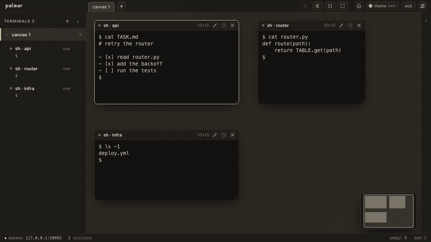

# palmar

*Read this in [English](README.md).*

**터미널 여럿을 한자리에. 각각은 놓아둔 자리를 지킨다.**



> palmar 는 모델을 돌리지 않고, API 를 부르지 않고, 당신의 작업을 어디로도 보내지 않는다.
> 셸을 열고 그것들이 어디 있는지 보여줄 뿐이다. 에이전트는 당신이 이미 쓰던 그것들이다.

## 왜

**무엇이 당신을 기다리는지 보인다.** 창마다 신호등이 있다 — 일하는 중·당신을 기다림·끝남·놀고 있음.
셸이 실제로 무엇을 하고 있는지에서 알아내므로 설정할 것도, 안에 든 에이전트와 맞출 것도 없다.
가장 오래 기다린 것이 목록 맨 위에 온다. 그 창이 화면 밖에 있어도 그렇다.

**창은 놓아둔 자리에 있는다.** 끌어 옮기고 크기를 바꾸면 셸의 행·열이 따라온다. 타일링이 아니고,
몰래 크기를 바꾸지도 않는다. 창끼리 겹치지 않는다 — 하나를 다른 것 위에 놓으면 겹친 만큼만 비켜난다.
잠깐 올려두고 있으면 함께 움직이는 **그룹**이 된다. 무엇을 하든 `Ctrl`/`⌘`+`Z` 한 번으로 되돌린다.

**당신 없이도 계속 돈다.** 셸은 데몬이 갖고 있다. 탭을 닫아도, 노트북을 덮어도 그대로다. 같은 주소로
돌아오면 두고 간 그대로 — 자리도 크기도 그룹도. 배치가 브라우저가 아니라 **데몬에** 있기 때문이다.

**파일이 바로 옆에 있다.** 캔버스 옆 레일이 지금 일하는 폴더다. 파일도 다른 창처럼 열린다 —
줄 번호가 붙은 텍스트, CSV 는 표, 웹 문서, PDF. 텍스트는 그 자리에서 고치고 저장한다. 그 사이에
다른 것이 그 파일을 썼다면, 이기는 대신 그렇다고 말해 준다.

**파이썬 말고는 설치할 것이 없다.** 표준 라이브러리와 함께 담아 둔 xterm.js 한 벌이 전부다.
빌드도, 패키지도, 실행 중 네트워크도 없다.

## 설치

한 줄. 이미 있어야 하는 것은 파이썬뿐이다 — macOS 에는 `/usr/bin/python3` 가 있고, 리눅스도 대개
하나는 있고, 윈도우는 python.org 의 것.

macOS · Linux:

```
curl -fsSL https://raw.githubusercontent.com/maengyo/palmar/main/install.sh | sh
```

윈도우, PowerShell 에서:

```
irm https://raw.githubusercontent.com/maengyo/palmar/main/install.ps1 | iex
```

먼저 읽어 보고 돌리려면(그리고 `-Check` / `-Prefix` 를 주려면):

```
irm https://raw.githubusercontent.com/maengyo/palmar/main/install.ps1 -OutFile install.ps1
powershell -ExecutionPolicy Bypass -File .\install.ps1
```

트리를 받아 두고, `palmar` 실행기를 놓고(`~/.local/bin`, 윈도우는 `%LOCALAPPDATA%\palmar\bin`),
PATH 에 한 번 올리고, 아무것도 시작하지 않는다. root 도 빌드도 없다. 먼저 읽어 보고 싶으면
`git clone https://github.com/maengyo/palmar && sh palmar/install.sh` 가 눈앞의 체크아웃을 설치하고,
`python3 -m palmar` 는 아무것도 설치하지 않고 돌린다. 윈도우는 네이티브(ConPTY)이고, 아직 거친
부분은 [`docs/windows.md`](docs/windows.md) 에 있다.

## 실행

```
palmar
```

주소를 찍고, 브라우저를 열고, **바로 돌아온다** — 데몬은 떨어져 나가므로 터미널을 닫아도 셸이 같이
죽지 않는다. 다시 `palmar` 를 치면 두 번째 데몬이 아니라 같은 주소를 준다. `palmar --stop` 이 끝낸다.
주소를 잃었으면 `cat ~/.palmar/run/url`.

같은 것을 자기 창에서 보여 주는 **741 KB** 짜리 프로그램도 있다([`app/`](app/README.md)) — OS 가 이미
가진 웹뷰를 쓰고, Electron 이 아니다. 둘을 같이 써도 된다: 데몬은 HOME 당 하나이고, 한쪽에서 연
터미널이 다른 쪽에도 바로 나타난다.

## 알아 둘 것

**터미널 안에서 도는 것은 palmar 를 조종할 수 있다.** 유닉스 권한은 *프로그램*이 아니라 *사용자*를
가른다. palmar 가 여는 셸은 당신으로 돌기 때문에, 한 판의 스크립트가 다른 판에 붙어 승인 질문에
대신 답할 수 있다. 당신으로 도는 것은 이미 당신의 SSH 키와 셸 시작 파일을 갖고 있다 — 다만 palmar 는
그것을 쉽고 구체적으로 만들고, 승인 질문은 사람이 답하라고 있는 것이다. 진짜로 막으려면 판마다 OS
경계가 필요한데, 그러면 palmar 는 다른 프로그램이 된다.

**열쇠는 주소 안에 있다.** 북마크가 재시작을 넘어 살아남는 값이다. 그 값의 전부와, 아직 안 만든
것들은 [`docs/decisions.md`](docs/decisions.md) 에 있다.

## 나머지

- [`AGENTS.md`](AGENTS.md) — 작업 규약. 무엇을 적기 전에 어떻게 확인하는가.
- [`docs/protocol.md`](docs/protocol.md) — 데몬과 브라우저 사이의 계약.
- [`docs/decisions.md`](docs/decisions.md) — 정해진 것과, 일부러 안 정한 것.
- [`docs/roadmap.md`](docs/roadmap.md) — 일의 순서.

살아 있는 목록은 [issues](https://github.com/maengyo/palmar/issues).

## 라이선스

MIT — [`LICENSE`](LICENSE). 이 저장소의 유일한 남의 코드는 `palmar/web/vendor/` 의 xterm.js 이고,
실행 중에 아무것도 받아오지 않으려고 같이 담아 두었다. 고지는 그 옆
[`LICENSE-xterm`](palmar/web/vendor/LICENSE-xterm) 에 있다.
