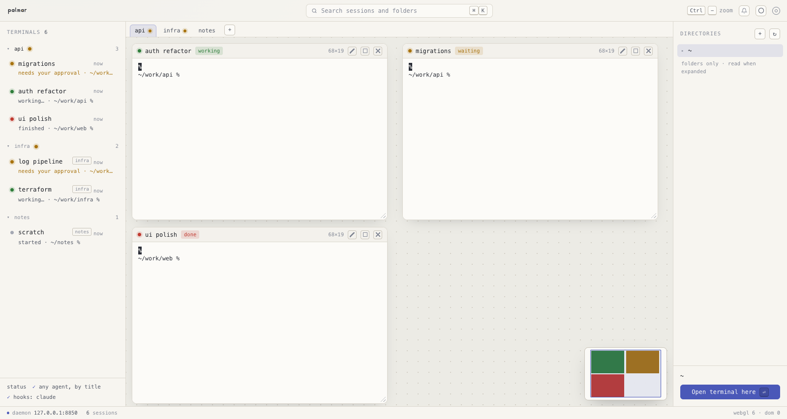

# palmar

*Read this in [English](README.md).*

> 한글판은 영어판보다 조금 뒤처져 있다. **창으로 쓰는 이야기**(`app/` — 브라우저 없이 자기 창에서
> 도는 741KB 프로그램, 맥·리눅스·WSLg)가 아직 여기 없다. 영어판의 "In a window instead" 와
> [`app/README.md`](app/README.md) 를 보면 된다.

터미널을 많이 띄워 놓고 쓰는 사람을 위한 가벼운 도구.

> **palmar 는 AI 도구가 아니다.** 모델을 돌리지 않고, API 를 부르지 않고, 당신의 작업을 어디로도
> 보내지 않는다. 하는 일은 셸을 열고 그것이 어디 있는지 보여 주는 것뿐이다. 에이전트는 **당신이
> 이미 돌리고 있는 것**이고 터미널도 **이미 쓰던 것**이다 — palmar 는 그 한 화면을 견딜 만하게
> 만들어 줄 뿐이다.

코딩 에이전트를 여러 개 돌리면 똑같이 생긴 터미널이 여러 개 생기고, 그중 하나는 1분 전에 멈춰서
아직 안 준 대답을 기다리고 있다. palmar 는 그것들을 캔버스에 올린다. 각 터미널은 놓아 둔 자리에
준 크기 그대로 있고, 저마다 불이 하나 붙는다 — **일하는 중**, **나를 기다림**, **끝남**, **한가함**.
안에서 무엇이 도는지 따로 알려 주지 않아도 알아낸다.

브라우저 탭을 닫아도 세션은 계속 산다.



## 무엇을 하나

**터미널에 자리가 있고, 그 자리를 지킨다.** 오른쪽 레일은 폴더와 파일을 보는 곳이고(파일을 누르면 읽기 전용 창이 뜬다), 새 터미널은 ＋ 나 Ctrl⏎ 로 홈에서
열린다. 제목 줄을 끌어 옮기고 모서리를 끌어 크기를 바꾸면 셸의 행·열이 따라간다 —
창을 넓히는 것이 곧 터미널을 넓히는 것이다. 창을 더할수록 캔버스는 자라고, 나머지는 스크롤로 닿는다.

**창은 겹치지 않는다.** 창을 끌어다 다른 창에 놓으면 거기 있던 창이 비켜난다 — 겹친 만큼만, 제일 가까운
쪽으로, 그게 또 세 번째에 닿으면 이어서. 타일링이 아니고 크기도 안 건드린다. 크기는 사람의 것이고 palmar
가 푸는 것은 겹침뿐이다. 몇 개가 움직였는지 아래에 한 줄로 뜨고, 되돌릴 수 있다.
단축키 판의 **Push windows aside** 로 끌 수 있다 — 끄면 창이 겹칠 수 있고, 누른 창이 앞으로 온다.

**캔버스는 탭이다.** 캔버스 위에 탭 줄이 있다. **＋** 로 만들면서 바로 이름을 묻고, 탭을 두 번 누르면
이름을 고치고, 끌면 자리를 바꾼다. 탭에는 **작은 점 하나**만 붙는다 — 그 캔버스 안에 나를 부르는 것이
있을 때. 그 밖에는 아무것도 안 붙는다. 탭의 주인은 페이지가 아니라 데몬이라, 열려 있는 브라우저
모두가 같은 탭을 같은 차례로 본다.

캔버스는 지울 수 있는데 **비어 있을 때만** 된다 — 지금 보고 있는 탭에서 마지막 터미널을 닫는 순간
× 가 나타나고, 그 전에는 없다. 캔버스를 지우는 일이 도는 프로세스를 죽이면 안 되므로, 안에 든 것을
같이 죽이는 길은 아예 만들지 않았다.

**왼쪽 목록은 캔버스로 거르지 않는다.** 어디에 있든 돌고 있는 것이 전부 들어 있다. 캔버스로 묶이고
접히지만, **접힘이 내가 필요한 것을 감추는 일은 없다.** 접힌 묶음도 기다리는 줄은 그대로 그리고,
머리글이 감춘 것 중 몇이 나를 부르는지 말한다. 차례는 탭 줄과 같고 **절대 안 바뀐다** — 손이
가 있는 목록이 눈앞에서 뛰지 않는다. 다른 캔버스의
줄에는 작은 이름표가 붙는다 — 누르면 그 캔버스로 넘어가 그 창 앞에 세워 준다.

**터미널 하나를 캔버스 전체로 펼칠 수 있다.** 펼치기 상자를 누르면 창이 캔버스를 가득 채우고, 행과 열이
실제로 늘어난다 — 카메라가 아니다. **Esc** 로 돌아온다. 펼친 동안에도 레일은 남는다. 가까이 보는 중에도
누가 기다리는지는 봐야 하니까.

**세션은 브라우저보다 오래 산다.** PTY 의 주인은 데몬이고, 페이지는 붙었다 떨어지는 손님이다. 탭을 닫고
주소를 다시 열면 그대로 있다. 반대로 **화면에서 터미널을 닫으면 진짜로 끝난다** — 창과 목록 줄 두 곳에
**×** 가 있고, 각각 그 자리에서 확인 줄을 펼친다(브라우저 기본 대화상자가 아니다). 열려 있는 다른
브라우저에서도 같은 순간에 사라진다.

**이제 뭘 해야 하나.** 신호등은 어느 터미널이 나를 부르는지 말하고, 오른쪽 레일은 **그중 무엇이
먼저인지**를 말한다. 기다리는 것을 **오래 기다린 순서로** 세운다 — 20분째 부르는 판과 방금 물어본
판은 같은 일이 아니다. 그 아래에는 **일하는 중이라면서 한참 아무것도 안 찍은** 판을 적는다.
그건 아무도 안 알려 주는 것이고, PTY 를 우리가 갖고 있어서 알 수 있다. 아무것도 안 기다리면
그렇게 말하고, 대신 없는 동안 있었던 일을 보여 준다.

**미니맵**이 지금 보고 있는 캔버스의 것으로 오른쪽 아래에 있다. 누르거나 끌어서 보는 자리를 옮긴다.

**내가 한 일 없이는 창이 안 움직인다.** 창을 다른 창 위에 놓으면 그 창은 움직인다 — 내가 거기로
겨눈 것이고, 뛰는 게 아니라 미끄러지고, 되돌리기가 바로 옆에 있다. 절대 없는 것은 **내가 안 한 일로
창이 움직이는 것**이다: 맨 아래 터미널을 닫으면 캔버스가 알아서 줄지만, 맨 위를 닫으면 위쪽 빈 자리는
남는다 — 그것을 거두려면 **눈앞에 있는** 창들을 움직여야 하기 때문이다. 탭 줄의 단추가 시킬 때 해 준다: 서로의 간격을 지킨 채 전부 구석으로 당겨지고, 거둘 것이 없으면
흐려진다. 저절로 되는 편이 낫다면 단축키 판의 **Tidy automatically** 를 켜면 된다.

**복사·붙여넣기.** 마우스로 고른 뒤 `Ctrl+Shift+C`(맥은 `⌘C`), 붙여넣기는 `Ctrl+Shift+V`(`⌘V`)
또는 브라우저 기본 붙여넣기. **`Ctrl+C` 는 건드리지 않는다** — 터미널에서 그것은 인터럽트고,
마침 뭔가 골라져 있다고 가로채면 멈추려던 것이 안 멈춘다. 단축키는 처음 글자를 고를 때 한 번 알려 준다.

**검색**은 `Ctrl K` (맥은 `⌘K`). 이름·경로·에이전트로 세션과 폴더를 찾는다.

**글자 크기는 터미널마다 따로 준다.** 터미널 위에서 `Ctrl`/`⌘` + 휠이면 그 판의 글자만 바뀐다.
창 크기는 그대로라 **행과 열이 따라 바뀐다** — 작게 하면 같은 자리에 로그가 더 들어가고, 크게 하면
멀리서도 읽힌다. 제목 줄의 크기 표시가 되돌리기 단추가 된다. `Ctrl −` 는 그대로 전체를 줄인다 —
그건 브라우저 자체의 기능이다.

## 설치

palmar 는 파이썬 표준 라이브러리와 저장소에 담긴 xterm.js 뿐이다 — 빌드할 것도, 받아 올 의존성도
없다. 그래서 설치란 셸이 찾을 자리에 놓는 일이 거의 전부고, 미리 있어야 하는 건 파이썬 하나다
(macOS 는 `/usr/bin/python3` 가 이미 있고, 리눅스도 대개 있다). 어느 쪽이든 한 줄이다:

```
git clone https://github.com/maengyo/palmar && sh palmar/install.sh   # 클론에서
```

`install.sh` 는 파이썬을 확인하고 `~/.local/bin` 에 `palmar` 실행기를 놓을 뿐, 그 외엔 아무것도
안 건드린다 — 루트도, `~/.palmar` 도, 데몬 실행도 없다. 먼저 읽어 보고 싶으면 파일로 받아
직접 실행하면 된다(짧다). 아니면 그냥 클론에서 바로 돌려도 된다:

```
python3 -m palmar
```

> 공개된 `curl … | sh` 한 줄과 PyPI 패키지(`uvx palmar`)는 준비 중이다 — 저장소가 아직 private 다.
> 나오면 `install.sh` 가 거기서 받아 오는 법을 이미 안다: `PALMAR_PYPI` 나 `PALMAR_TARBALL` 을 주면
> 된다.

## 해 보기

마지막 줄에 주소를 찍는다 — `http://127.0.0.1:8801/?k=…`. 그 주소를 열면 되고, 북마크해도 된다:
열쇠는 다시 켜도 그대로라 북마크가 계속 열린다. 주소를 잃었으면 `cat ~/.palmar/run/url`.

열쇠는 같은 기계의 다른 프로세스가 데몬에게 페이지를 달라고 해서 그 안의 토큰을 읽어 가는 것을 막는다.

설치할 것도, 빌드할 것도 없다. 파이썬 표준 라이브러리만 쓰고 xterm.js 는 저장소 안에 넣어 두었으므로,
받아 오는 의존성이 하나도 없다 — 설치할 때도, 실행할 때도. `127.0.0.1` 에만 묶인다.

`Ctrl-C` 로 끈다.

## 아무것도 설정하지 않는 신호등

신호등은 **맞을 때만**, 그리고 **실제로 쓰는 에이전트에서 켜질 때만** 값이 있다.

**에이전트는 바쁘다는 것을 이미 말하고 있다 — 창 제목으로.** 생각하는 동안 제목에 스피너를 돌리고
멎으면 뗀다. palmar 는 PTY 의 주인이라 그 바이트를 그대로 보고, 거기서 상태를 읽는다. 설치할 것도,
설정 파일도, 받아야 할 허락도 없다. **palmar 가 배운 적 없는 에이전트에서도 켜진다.**

스피너 글자표는 만들지 않는다. 에이전트마다 제 글자를 쓰므로, 그런 표는 새 에이전트가 나오는 날
틀린다. 대신 **얼마나 자주 바뀌는지**를 본다 — 3초 안에 제목이 두 번 넘게 바뀌었으면 그건 정의상
스피너다. 돌면 *working*, 돌다가 멎으면 *done*, 한 번도 안 돌았으면 *idle* 그대로다. 그래서 판에 띄워
둔 편집기가 "끝난 일" 로 잘못 켜지지 않는다.

**제목을 아예 안 쓰는 에이전트도 켜진다.** 그때는 **무엇이 돌고 있는지와 찍고 있는지**로 읽는다 —
도는 것이 없으면 한가함, 찍으면 일하는 중, 찍다가 멎으면 나를 부름. 앞의 것이 **맨 셸의 프롬프트를
안 켜지게** 지킨다. 정직한 한계는 하나다: 아무것도 안 찍으면서 오래 생각하는 에이전트는 끝난 것과
구분되지 않는다.

**훅을 주는 에이전트에서는 훅을 쓴다.** 제목은 짐작이고 훅은 정확하기 때문이다 — 승인을 기다리는 것과
턴이 끝난 것을 가릴 수 있다. 훅은 스스로 붙는다. palmar 가 여는 모든 셸의 `PATH` 앞에 작은 껍데기가
놓이므로 여기서도 사용자가 할 일은 없다. zsh 와 bash 에서 된다.

**화면을 palmar 가 갖고 있지 않을 때는 알림이 찾아온다.** 브라우저 탭이 나를 부르는 개수를 세고,
파비콘에 점이 붙고, 위쪽 막대의 벨로 진짜 알림을 켠다. **켜기 전에는 꺼져 있고**, 권한은 그 벨을 누를
때 묻는다(뜨자마자 묻지 않는다). 상태로 **바뀌는 순간에만** 울리고, 여럿이 한꺼번이면 알림 하나로
묶이고, 누르면 그 터미널 앞으로 데려간다.

## 무엇으로 만들었나

| | |
|---|---|
| 데몬 | 파이썬 표준 라이브러리만 — PTY, HTTP, 웹소켓, 훅. 한 파일, 약 2,500줄. |
| 파이썬 | 3.9 이상. |
| 브라우저 | 순수 자바스크립트. 프레임워크도 빌드 단계도 없다. 터미널은 xterm.js 가 그린다. |
| 도는 곳 | macOS 와 리눅스. 윈도우는 지금은 WSL 안에서 띄우고 윈도우 브라우저로 연다 — 네이티브 윈도우는 다음 이식 대상이지 옵션 하나가 아니다. |
| 네트워크 | **바깥으로 나가는 것이 없다.** 데몬에 HTTP 클라이언트가 없고, 페이지도 어디서든 아무것도 안 불러온다 — CDN 도, 글꼴 호스트도, 원격 수집도 없다. `127.0.0.1` 에 묶어 페이지를 내주는 것이 여는 소켓의 전부다. |
| 보안 | 페이지는 열쇠가, 모든 API 요청은(읽기 포함) 토큰이 있어야 한다. `Origin`·`Host` 검사도 한다. 판마다 자기 pty 만 들고 있다. **판끼리는 격리하지 않는다** — 아래 참고. |

## palmar 가 막아 주지 않는 것

반대로 믿기 쉬운 것이라 분명히 적는다.

**터미널 안에서 도는 것은 palmar 를 조종할 수 있다.** 유닉스 권한은 **사람을 나누지 프로그램을
나누지 않는다.** `0600` 은 "나만" 이지 "palmar 만" 이 아니고, palmar 가 여는 셸도 나로 돈다. 그래서
한 판의 스크립트나 에이전트가 데몬의 토큰을 읽어 다른 판에 붙을 수 있다 — 그 판의 출력을 읽고,
키를 넣고, **다른 에이전트의 승인 프롬프트에 대신 답하는 것까지.** 판의 `PATH` 맨 앞에 있는 훅
shim 을 바꿔 쓸 수도 있다.

palmar 가 낸 구멍은 아니다. 내 권한으로 도는 못 믿을 것이 있다면 SSH 키도 브라우저 쿠키도 셸
설정 파일도 이미 그쪽 것이다. 다만 palmar 는 그것을 쉽고 구체적으로 만들고, 승인 프롬프트는
**사람이 답하라고 있는 것**이라 그 대목이 아프다.

진짜로 막으려면 판마다 다른 사용자나 컨테이너가 필요한데, 그러면 palmar 는 다른 물건이 된다.
그래서 고치는 척하지 않고 적어 둔다.

**열쇠는 주소에 있다.** 북마크가 다시 켠 뒤에도 열리는 값이다. 다른 계정이 프로그램을 돌릴 수
있는 기계라면, 데몬이 멈춘 사이 그 계정이 포트를 차지하고 있다가 거기 열리는 페이지에서 열쇠를
받아 갈 수 있다. 그래서 **페이지는 스스로 열쇠를 보내지 않는다** — 대신 새로고침을 청한다.
다만 가짜가 포트를 쥐고 있는 동안 내가 직접 링크를 열면 그때는 넘어간다. 데스크톱 판에서는
유닉스 소켓을 쓸 것이라 훔칠 포트 자체가 없다.

## 아직 안 만든 것

- **새로 열리는 창은 아무것도 밀지 않는다.** 대신 빈 자리에 놓이고, 캔버스가 무한히 자라니 그 자리는
  언제나 있다. 미는 것은 내 손이 — 창을 끌어다 놓거나 키워서 다른 창에 닿게 할 때 — 일으킨다.
- **터미널을 다른 캔버스로 옮기는 단추가 없다.** 데몬은 하고 열린 브라우저가 모두 따라오지만,
  그 손잡이가 화면 어디에 붙어야 하는지가 아직 안 정해졌다.
- **데몬을 다시 띄우면 셸은 여전히 다 죽는다.** 대신 **어디 있었는지**는 돌아온다 — 캔버스는
  스스로 돌아오고, 터미널은 제안으로 뜬다. 붙였던 이름과 있던 폴더(`cd` 해서 간 자리까지)를 달고
  나오며, 한 번 누르면 다시 열린다. 셸 자체를 새 데몬에 넘기는 일은 안 하고, 하는 척도 안 한다.
- **fish 셸에는 훅 껍데기가 안 붙는다.** 제목으로 읽는 신호등은 거기서도 된다.
- **설정 화면**, 그리고 검색칸 뒤의 명령 팔레트.
- **네이티브 윈도우.** 데몬이 뼛속까지 POSIX 다 — `pty.fork`, `tcgetpgrp`, `flock`, 시그널,
  `0600` — 거기서는 import 조차 안 된다. ConPTY 를 `ctypes` 로 부르면 의존성 없이 닿을 수 있지만,
  옵션 하나가 아니라 데몬 이식이다. 그전까지는 WSL 로 된다.

## 어떻게 도나

```
┌─ 왼쪽 ────┬─ 캔버스 ───────────────┬─ 오른쪽 ──┐
│ 터미널    │ 놓아 둔 자리에, 준     │ 폴더만    │
│ 목록      │ 크기 그대로, 지금 보는 │ 펼칠 때   │
│ 기다리는  │ 캔버스 위에            │ 읽는다    │
│ 것이 위   │                        │           │
└───────────┴───────────┬────────────┴───────────┘
                        │ 웹소켓: 바이트·상태·캔버스
┌───────────────────────┴────────────────────────┐
│  palmar 데몬 — PTY 의 주인, 상태를 읽고,       │
│  캔버스를 갖는다. 브라우저가 없어도 산다.      │
└──────┬─────────────────────┬───────────────────┘
       │ PTY: 바이트 오가기, │ 훅 — 에이전트가 줄 때, 판마다
       │ 크기 바꾸기         │
┌──────┴─────────────────────┴───────────────────┐
│  판 하나는 셸 하나. 무엇을 돌릴지는 사용자의   │
│  몫이다. 상태는 그것이 내는 것에서 읽는다.     │
└────────────────────────────────────────────────┘
```

palmar 는 셸만 연다 — 도구 목록도 없고, 무엇을 돌릴지에 대한 의견도 없다. 데몬은 PTY 와 캔버스와
상태를 갖고, 브라우저는 창이 어디에 놓였는지를 갖는다.

둘 사이의 약속은 [`docs/protocol.md`](docs/protocol.md) 에 적혀 있다 — 엔드포인트 전부, 웹소켓 둘,
흐름 제어, 링버퍼, 그리고 상태를 어떻게 정하는지. 데몬은 그 문서를 구현할 뿐 그 밖으로 나가지 않는다.

## 개발

데몬을 띄우고 찍힌 주소를 열면 된다. 브라우저 파일은 `web/` 에서 그대로 나가므로 고치고 새로고침하면
바로 보인다. `dev/dev-stub.py` 는 같은 페이지를 가짜 세션과 함께 내주는 가짜 데몬이다 — 진짜 셸을
띄우지 않고 화면만 손볼 때 쓴다.

- [`AGENTS.md`](AGENTS.md) — 작업 약속. 주장을 어떻게 확인하는지, 측정에 무엇을 적는지,
  저장소에 무언가를 더할 때의 규칙.
- [`docs/protocol.md`](docs/protocol.md) — 데몬과 브라우저 사이의 계약.
- [`docs/decisions.md`](docs/decisions.md) — 정한 것과, **일부러 안 정해 둔 것**.
- [`docs/roadmap.md`](docs/roadmap.md) — 일의 차례와 무엇이 무엇을 막는지.

살아 있는 목록은 [이슈](https://github.com/maengyo/palmar/issues)다.

## 라이선스

palmar 는 MIT 다 — [`LICENSE`](LICENSE).

이 저장소가 함께 싣는 남의 코드는 xterm.js(`@xterm/xterm`, `@xterm/addon-fit`,
`@xterm/addon-webgl`) 하나뿐이다. 실행할 때 아무것도 받아 오지 않도록 `palmar/web/vendor/` 에 넣어 두었다.
그것도 MIT 이고 고지는 [`palmar/web/vendor/LICENSE-xterm`](palmar/web/vendor/LICENSE-xterm) 에 있다 — 줄인 빌드에는
자체 머리말이 없어서 파일 옆에 따로 둔다.
