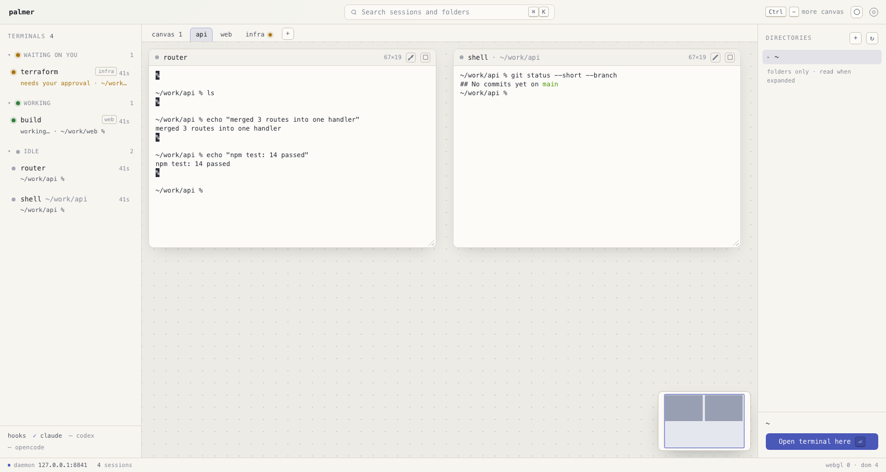

# palmer

*Read this in [한국어](README.ko.md).*

A spatial canvas for coding agents. Terminals sit where you put them, at the size you gave them,
on canvases you tab between. Each one shows whether it is **working**, **waiting on you**, **done**,
or **idle** — and it works out which without being told anything about the agent inside.

Close the browser tab and the sessions keep running.



## What it does

**Terminals have a place, and keep it.** Pick a folder in the right rail, press *Open terminal
here*, and a shell opens on the canvas at that path. Drag the title bar to move it, the corner to
resize it — the shell's rows and columns follow, so a wider window is really a wider terminal.
The canvas grows as you add windows; scroll to reach the rest.

**Canvases are tabs.** A strip above the canvas holds them. **＋** makes one and asks for its name;
double-click a tab to rename it, drag to reorder. A tab carries one small dot when something in
that canvas wants you, and nothing else — no counts, no close buttons. Every open browser sees the
same tabs in the same order, because the daemon owns them, not the page.

**The left list is never filtered by canvas.** Everything you have running is in it, wherever it
lives. It groups by canvas and folds, but folding can never hide the thing you are needed for: a
canvas with something waiting floats to the top, a folded group still draws its waiting rows, and
its header says how many of the sessions it hid are asking for you. A row from another canvas
carries a small badge — click it and palmer switches to that canvas and brings you to the window.

**One terminal can fill the canvas.** The expand box blows a window up to the whole canvas, and its
rows and columns genuinely grow — this is not a camera. **Esc** brings you back. The rails stay
while you are zoomed in, because you still need to see who is waiting.

**Sessions outlive the browser.** The daemon owns the PTYs; the page is a client that attaches and
detaches. Close the tab, reopen the URL, and everything is where you left it. Closing a terminal in
the UI, on the other hand, really ends it — there is an **×** on the window and on the list row, and
each unfolds a confirmation in place rather than a native dialog. A second open browser drops the
window at the same moment.

**A minimap** sits bottom-right for the canvas you are on. Click or drag in it to move the viewport.

**Search** with `Ctrl K` (`⌘K` on a Mac) reaches every session and folder by name, path, or agent.

**`Ctrl −` gives you more canvas.** It is the browser's own zoom, so the cell shrinks and every
terminal gets more rows and columns at once.

## Quick start

```
python3 server/palmerd.py
```

It prints `http://127.0.0.1:8801` on its last line. Open that.

There is nothing to install and nothing to build. palmer uses only the Python standard library, and
xterm.js is vendored in the repo, so no dependency is fetched — at install time or at runtime. It
binds `127.0.0.1` and nothing else.

Stop it with `Ctrl-C`.

## Status lights, without configuring anything

A light is only worth having if it is right, and if it works for the agent you actually run.

**Agents already say when they are busy — in the window title.** They animate a spinner into it
while they think and drop it when they stop. palmer owns the PTY, so it sees that stream and reads
the state straight off it. Nothing to install, no config file, no permission to grant, and it works
for an agent palmer has never been taught about.

It does not keep a table of spinner characters, because every agent draws its own and any such
table would be wrong the day a new one appears. **It watches the churn instead**: a title that
changes twice in three seconds is a spinner by definition. Spinning is *working*; spinning that
stops is *done*; a title that never spun stays *idle*, so a text editor parked in a pane is not
mistaken for a finished job.

**Where an agent offers hooks, palmer uses those instead**, because a hook is exact where a title
is inferred — it can tell an approval prompt from a finished turn. Hooks attach themselves: every
shell palmer opens gets a small shim in front of `PATH`, so there is still nothing for you to set
up. This works in zsh and bash.

**Notifications reach you when palmer does not have the screen.** The browser tab counts what wants
you, the favicon carries a dot, and the bell in the top bar turns on real notifications. It is off
until you turn it on, it asks for permission on that click and never on load, it fires only when a
terminal *becomes* one that wants you, several at once arrive as one notification, and clicking it
takes you to that terminal.

## Built on

| | |
|---|---|
| Daemon | Python standard library only — PTYs, HTTP, WebSocket, hooks. One file, ~1,700 lines. |
| Python | 3.9 and up. |
| Browser | Vanilla JavaScript, no framework, no build step. xterm.js draws the terminals. |
| Runs on | macOS, Linux, and WSL (run the daemon inside WSL, browse from Windows). |
| Security | Binds `127.0.0.1` only. A token in a `0600` file, plus `Origin` and `Host` checks, on every request that changes anything. |

## What is not built yet

- **Windows do not push each other aside.** A new one lands in the first free grid slot; dragging
  one onto another overlaps them.
- **No button deletes a canvas, and none moves a terminal between canvases.** The daemon does both
  and every open browser follows along — where the handles belong on screen is not settled.
- **Nothing survives restarting the daemon** — not the canvases, not the names, not the shells.
- **fish shells do not get the hook shim.** Title-based status still works there.
- **A settings panel**, and a command palette behind the search box.

## How it works

```
┌─ left ────┬─ canvas ───────────────┬─ right ───┐
│ terminal  │ terminals sit where    │ directory │
│ list      │ you put them, at the   │ folders   │
│ waiting   │ size you gave them,    │ only,     │
│ on top    │ on the canvas you      │ read when │
│           │ tabbed to              │ expanded  │
└───────────┴───────────┬────────────┴───────────┘
                        │ WebSocket: bytes, status, canvases
┌───────────────────────┴────────────────────────┐
│  palmer daemon — owns the PTYs, reads status,  │
│  keeps the canvases. Alive with no browser.    │
└──────┬─────────────────────┬───────────────────┘
       │ PTY: bytes in and   │ hooks, per pane, when the agent has them
       │ out, resize         │
┌──────┴─────────────────────┴───────────────────┐
│  a pane is a shell. Run whatever you like in   │
│  it. Status is read from what it writes.       │
└────────────────────────────────────────────────┘
```

palmer opens shells and nothing else — it has no list of tools and no opinion about what you run.
The daemon holds the PTYs, the canvases, and the status; the browser holds where the windows sit.

The wire format between them is written down in [`docs/protocol.md`](docs/protocol.md): every
endpoint, both WebSockets, the flow control, the ring buffer, and how status is decided. The daemon
implements that document and nothing beyond it.

## Development

Run the daemon and open the printed URL; the browser files are served straight from `web/`, so a
reload picks up an edit. `web/dev-stub.py` is a fake daemon that serves the same page with invented
sessions, for working on the UI without spawning real shells.

- [`AGENTS.md`](AGENTS.md) — the working agreement: how claims are checked, what goes in a
  measurement, and the rules for anything added to the repo.
- [`docs/protocol.md`](docs/protocol.md) — the contract between daemon and browser.
- [`docs/decisions.md`](docs/decisions.md) — what is settled, and what is deliberately still open.
- [`docs/roadmap.md`](docs/roadmap.md) — the order of work and what blocks what.

The living list is the [issues](https://github.com/maengyo/palmer/issues).

## License

palmer is MIT — see [`LICENSE`](LICENSE).

The only third-party code in this repo is xterm.js (`@xterm/xterm`, `@xterm/addon-fit`,
`@xterm/addon-webgl`) under `web/vendor/`, vendored so palmer fetches nothing at runtime. It is MIT
too; its notice is [`web/vendor/LICENSE-xterm`](web/vendor/LICENSE-xterm), kept beside the files
because the minified builds carry no header of their own.
